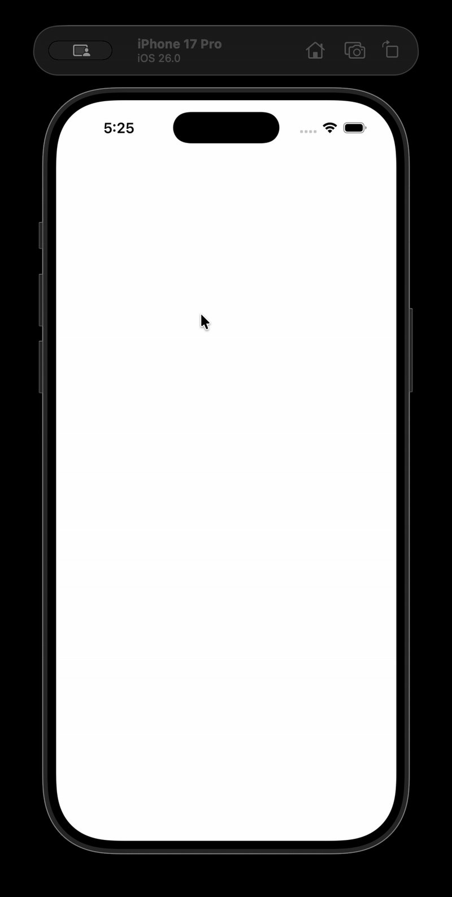
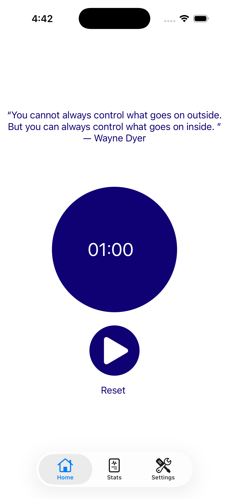
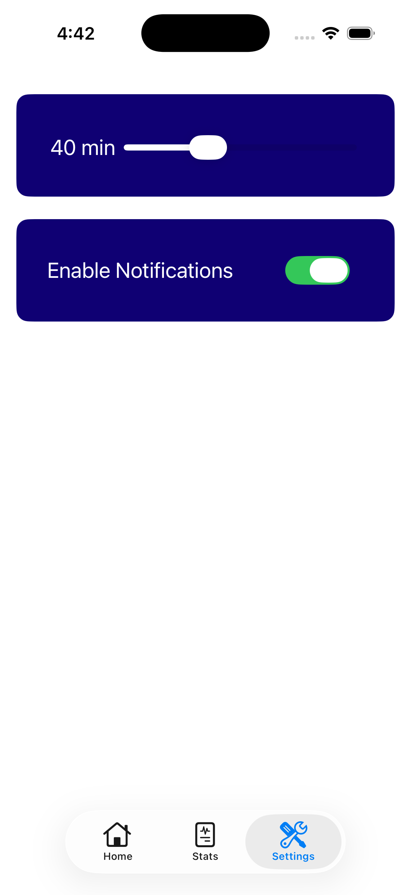
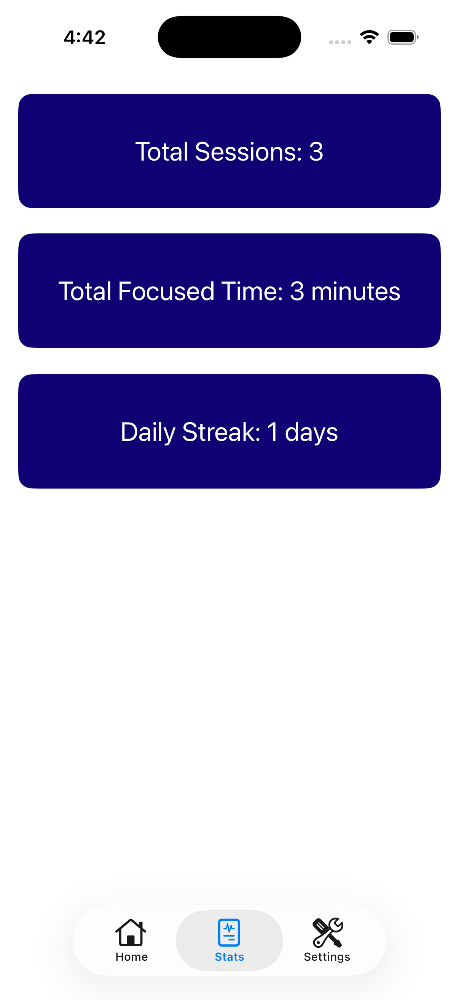

# Circura – iOS Focus Time App
*by Lucas Lopez*

*Pomodoro style focus timer built with UIKit, MVVM architecture, custom circular progress view, and motivational quotes from public API.*

<p align="left">

   
  
  
  
  
  
  

</p>

---

## Demo  

<p align="center">
  
</p>

---

## Overview  
**Circura** is a minimal focus-timer app designed to help users stay productive through structured sessions, stats tracking, and motivational quotes.
Features:
- Professional UIKit architecture
- MVVM with separation of concerns
- Real API networking
- Persistent storage for user settings + session history
- A custom circular timer component
- Clean, readable, maintainable code

---

## Tech Stack

<p align="left">

 
  
  
  
  
  
  


</p>

---

## Features  

### Focus Timer
- Adjustable session duration (default 25 minutes)
- Live countdown with smooth updates
- Start / Pause / Reset
- Hides reset button while running
- Clean MVVM state management

### Custom Circular Timer View
- CAShapeLayer
- UIBezierPath
- Adjustable line width & colors
- Progress updates reflected via strokeEnd property
- Inner filled circle
- @IBDesignable & @IBInspectable support

### Motivational Quotes
- API:
`https://zenquotes.io/api/random`
- Cross-fade text animation
- Uses last successful quote as fallback when offline

### Stats Screen
- Total sessions completed
- Total focused minutes
- Daily streak calculation
- Powered by StorageService
- Robust streak calculation using calendar-based day comparison

### Settings
- Adjust timer length via slider
- Toggle notifications
- Timer length changes automatically sync to the Home screen via NotificationCenter
- 	Handles all iOS authorization states: notDetermined, denied, authorized, provisional, ephemeral
- Shows “Open Settings” alert when notifications are denied
- Removes pending notifications when disabled

### Persistent Storage
Abstracted through StorageService:
- Saves completed focus sessions
- Saves timer length
- Saves notification preferences
 
---

## Screenshots  

<p align="center">
  
  
  
</p>


<p align="center">
  <em>Left: Focus Timer · Center: Settings · Right: Stats Overview</em>
</p>

---

## Architecture

Circura follows a clean **MVVM + Services** pattern with strong separation of concerns. 

---

### MVVM Overview

| Layer | Responsibility |
|-------|---------------|
| **Model** | Defines Session object. |
| **ViewModels** | Timer logic, Settings state, Stats calculations. |
| **Views/Controllers** | UIKit Storyboard screens, UI only. |
| **Services** | Persistent storage behind API. |

---

## Project Structure
```bash
Circura/
│
├── Screenshots/
│   ├── demo.gif
│   ├── timer_screen.png
│   ├── settings_screen.png
│   └── stats_screen.png
│
├── Screens/
│   ├── Timer/
│   │   └── ViewController.swift
│   ├── Settings/
│   │   └── SettingsViewController.swift
│   └── Stats/
│       └── StatsViewController.swift
│
├── Views/
│   └── CircularTimerView.swift
│
├── ViewModels/
│   ├── TimerViewModel.swift
│   ├── SettingsViewModel.swift
│   └── StatsViewModel.swift
│
├── Services/
│   └── StorageService.swift
│
├── Models/
│   └── Session.swift
│
├── Assets/
├── Main.storyboard
├── AppDelegate.swift
├── SceneDelegate.swift
└── README.md
```

---

## Key Implementation Details

### Timer View Model
- Countdown logic
- Session completion
- Quote refresh cycle
- Progress updates
- Notifications
- Persists completed sessions

### Storage Service
- Prevents scattering UserDefaults calls across the app.

### Stats View Model
- Total sessions
- Total focused minutes
- Consecutive-day streak

### Settings View Model
- Broadcasts timer-length changes using NotificationCenter so the Home screen updates immediately
- Notification toggles

### Custom Circular Timer View
- Uses Core Animation layers
- Provides smooth, configurable visual progress

---

## Installation

### Requirements
- Xcode 15+  
- iOS 17+  
- Swift 5.9
- UIKit

### Steps
1. Clone the repo
    ```bash
    git clone https://github.com/lucastricanico/circura-ios-app.git
    ```
2. Open in Xcode
3. Run the Project
4. Lock in and Study!

---

## Future Improvements
### UI & UX
- Haptic feedback
- Custom tab bar icons / animations
- Dark mode

### Logic of the App
- Long-term stats overview
- Exportable history
- Weekly + monthly charts

### Networking
- Local cached quotes
- Custom quote categories

---

## License
Released under the MIT License.

See LICENSE for details.
